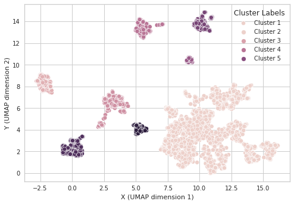
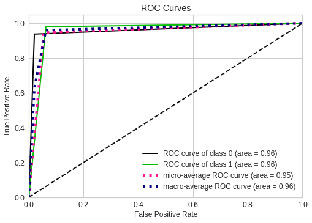

 
<h1> DBNex: Deep Belief Network and Explainable AI based Financial Fraud Detection</h1>

[Abhimanyu Bhowmik](https://scholar.google.com/citations?user=r3bzJ7oAAAAJ&hl=en), [Madhushree Sannigrahi](https://scholar.google.com/citations?user=Mtnm7igAAAAJ&hl=en), [Deepraj Chowdhury](https://scholar.google.com/citations?user=9sZgeV4AAAAJ&hl=en), [Ashutosh Dhar Dwivedi](https://scholar.google.com/citations?user=EjGUfp0AAAAJ&hl=en), [Raghava Rao Mukkamala](https://scholar.google.com/citations?user=VkhjFd4AAAAJ&hl=en)

 
 

 

> **Abstract:** *The majority of financial transactions are now conducted virtually around the world. The widespread use of credit cards and online transactions encourages fraudulent activity. Thus, one of the most demanding real-world challenges is fraud detection. Unbalanced datasets, in which there are a disproportionately high number of non-fraud samples compared to incidents of fraud, are one of the key obstacles to effective fraud detection. A further factor complicating the learning process for cutting-edge machine learning classifiers is how quickly fraud behaviour changes. Thus, in this study, we suggest an efficient fraud detection methodology. We propose a unique nonlinear embedded clustering to resolve imbalances in the dataset, followed by a Deep Belief network for detecting fraudulent transactions.*

<h2>About Dataset</h2>

<h3>Context</h3>

The Credit Card Fraud Detection dataset by Worldline and the Machine Learning Group of ULB (Universit´e Libre de Bruxelles) is used in this paper. It includes labelled anonymized credit card payments made by European card users in September 2013.

<h3>Content</h3>

The dataset contains `492 frauds` out of `284,807 transactions` that took place over the course of `2 days`.

Dataset Specifications:

* PCA (Principle Component Analysis) transformed into features V1, V2,... V28 
* Time
* Amount
* Class

**Note:** Only 0.172% of the transactions in the dataset are fraudulent,
which indicates a severe lack of balance.

Sample Dataset from the actual dataset can be found in the the folder `./Data and Model`.

<h2>Proposed Methods</h2>

<!--
  ======================Global Architecture===========================
                          -->

<h3>1. Globar Architecture</h3>

  

Overall view of the proposed model: DBNex 

 

<!--
  =========================Data Preprocessing========================= 
                          -->
 

<h3>2. Data Preprocessing</h3>

<h4>Uniform Manifold Approximation and Projection (UMAP)</h4>

Clustering of UMAP-based 2D embedding of non-fraud samples using DBSCAN 

<h4>Density-Based Spatial Clustering of Applications with Noise or DBSCAN</h4>

Silhouette score of DBSCAN Clusters for non-fraud samples where ϵ ranging from 0.1 to 0.6. 

 

<!--
  ============================Model=========================
                          -->

<h3>3. Proposed Model </h3>

Architecture of Deep Belief Network 

 

<!--
  ====================================RESULTS===============================
                          -->

<h2>Results </h2>
<h3>1. Classification Report</h3>

Classification report for 70:30 train-validation ratio

<h3>2. Confusion Matrix</h3>

Confusion matrix: Fraud-NonFraud classes

  

<h3>3. ROC - AUC Curve</h3>

Receiver operating characteristic curves: Fraud-NonFraud classes

  

<h3>4. Classification Explainability using SHAP</h3>

<table>
  <tr>
    <td width="50%">  (a) </td>
    <td width="50%">  (b) </td>
  </tr>
</table>

(a), (b) Beeswarm plot of testing dataset for both the classes (left) Heatmap plot of testing dataset for both the classes (right).

  

<h2>Cite our work</h2>

    
    Bhowmik A., Sannigrahi M., Chowdhury D., Dwivedi A., Mukkamala R. (2022). DBNex: Deep Belief Network and Explainable AI based Financial Fraud Detection. Acepted in IEEE International Conference on Big Data (IEEE BigData 2022).

<h2>Contact</h2>
For any queries, please contact: <a href="mailto:bhowmikabhimnayu@gmail.com">bhowmikabhimnayu@gmail.com</a>